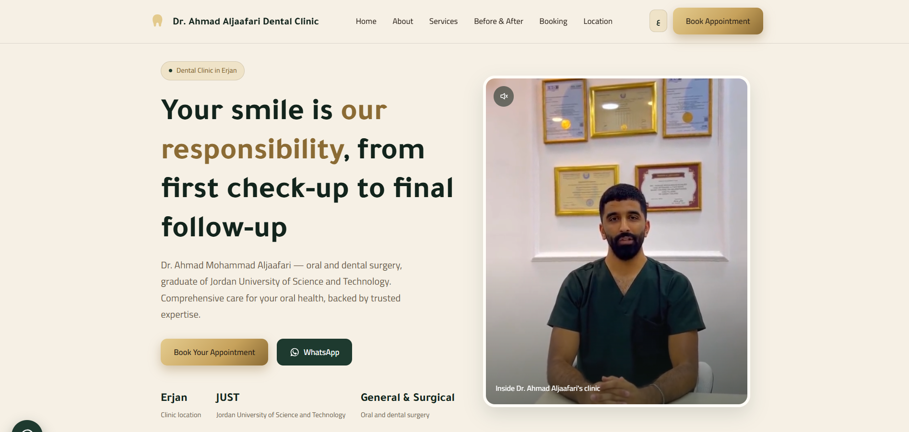
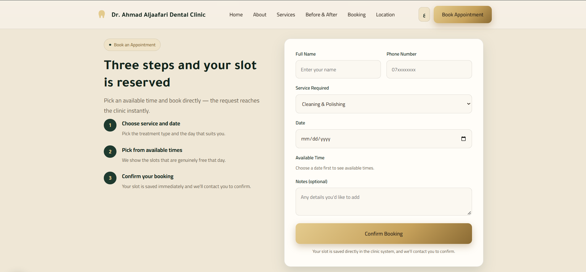

# AJ Clinic — Dental Appointment Booking System

A bilingual (Arabic/English) website and appointment-booking system built for a real dental clinic in Amman, Jordan. Patients book their own slots; the clinic gets notified instantly.

**Live:** [aj-clinic.vercel.app](https://aj-clinic.vercel.app)





---

## The problem

Small clinics in Jordan take bookings through three or four channels at once — phone calls during working hours, WhatsApp messages at midnight, Instagram DMs, and walk-ins. There is no single place where the day's schedule actually lives, so requests get missed and slots get double-booked.

The clinic I built this for was losing patients who messaged after hours and got no reply.

## What it does

* **Self-service booking** — patients pick a real available slot from the clinic's working hours (9:00 AM – 10:00 PM). The slot is written to a database, not to a chat thread.
* **Instant WhatsApp notification** — the doctor is notified the moment a booking lands. WhatsApp is the notification channel, not the booking system.
* **Full Arabic / English support** — including right-to-left layout, not just translated strings.
* **Results gallery** — an interactive before/after section using real (consented) patient case photos.
* **Responsive** — most traffic to clinic sites in Jordan comes from phones, so mobile was the primary target, not an afterthought.

## Tech stack

|Layer|Choice|
|-|-|
|Framework|Next.js (App Router)|
|Database|PostgreSQL, hosted on Neon|
|Backend|Next.js route handlers|
|Notifications|WhatsApp Cloud API|
|Hosting|Vercel|
|Styling|Tailwind CSS|

## Design decisions

**Why a database instead of WhatsApp-based booking.**
The first version of this project handled booking entirely through WhatsApp messages. It worked, but the clinic had no queryable record of its own schedule — the source of truth lived inside a chat app nobody could search. Moving bookings into PostgreSQL made the schedule a real data structure: it can be queried, validated against existing bookings, and reported on later. WhatsApp was demoted to a notification channel, which is what it is good at.

**Why Neon.**
The clinic's traffic is bursty and low-volume — heavy in the evening, near zero overnight. Neon's serverless Postgres scales to zero between requests, which keeps the running cost near nothing at this scale while still being a real Postgres database rather than a proprietary substitute I would later have to migrate off.

**Why the working hours live in configuration, not in the code.**
Clinic hours change (Ramadan, holidays, a new assistant). Hard-coding them would mean a redeploy every time. They are configuration so the schedule can change without touching the application.

## Security

This system handles sensitive data, so access control was treated as a first-class concern rather than a checkbox.

**Authentication fails closed.** Session verification happens in middleware covering `/admin/*` and `/api/admin/*`, so a newly added admin route is protected by default — a developer would have to explicitly add it to a public allow-list to expose it. The per-route session checks were kept in place as a second layer: if the middleware matcher is ever misconfigured, the routes still defend themselves. Sessions are signed JWTs in `httpOnly` cookies, verified server-side with a pinned algorithm; a missing signing secret results in a redirect to login, never a bypass.

**Login rate limiting counts by IP, not by username.** Counting failed attempts per username would let anyone who knows the admin username lock the doctor out of his own clinic with five wrong guesses — a trivial denial-of-service against a business that needs its schedule during working hours. Counting by IP raises the cost of guessing while keeping the dashboard reachable. The trade-off is accepted knowingly.

**Timing leak closed.** The login endpoint returns an identical error message whether or not the username exists, but response time originally gave it away — a missing user skipped the bcrypt comparison entirely and returned in under a millisecond. A dummy hash comparison now runs on the miss path. Measured over 12 samples: 78.7ms for an existing account versus 78.9ms for a nonexistent one, a 0.2% difference well inside measurement noise.

**No secrets in the repository.** All credentials are read from environment variables, with no fallback values in code. The seed script requires `SEED_ADMIN_PASSWORD` to be set and fails with a clear error otherwise, rather than creating an account with a default password.

## Running locally

```bash
git clone https://github.com/habebcss/AJ-clinic.git
cd AJ-clinic
npm install
cp .env.example .env.local   # fill in your own values
npm run dev
```

Open http://localhost:3000.

You will need a Neon (or any PostgreSQL) connection string, and a WhatsApp Cloud API token if you want notifications to fire. The site runs without the WhatsApp credentials — bookings are still saved, the notification step is just skipped.

## Project status & roadmap

This is in production use by the clinic. Planned next:

- [ ] Admin dashboard so the clinic can view and cancel bookings without touching the database
- [ ] Automated reminder message 24 hours before an appointment (no-shows are the clinic's second biggest complaint)
- [ ] Per-service appointment durations — a cleaning and a root canal should not occupy the same slot length

## Related

A separate on-premises patient records and payments system was built for the same clinic — a password-protected Node.js/Express application that runs on the clinic's local network so the secretary and the doctor can use it simultaneously. Patient records stay inside the clinic and never leave the premises, which was a deliberate choice for medical data.

## Author

**Habeb Ziad Mahmoud** — Computer Science student, Amman Arab University
Building full-stack web applications for small businesses in Jordan.

Open to junior / part-time developer roles in Amman (on-site or remote).
